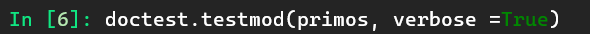
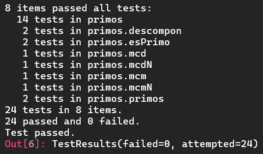

# Segunda tarea de APA 2023: Manejo de números primos

## Nom i cognoms: Núria Rodríguez Pardo

## Fichero `primos.py`

- El alumno debe escribir el fichero `primos.py` que incorporará distintas funciones relacionadas con el manejo
  de los números primos.

- El fichero debe incluir una cadena de documentación que incluirá el nombre del alumno y los tests unitarios
  de las funciones incluidas.

- Cada función deberá incluir su propia cadena de documentación que indicará el cometido de la función, los
  argumentos de la misma y la salida proporcionada.
Y
- Se valorará lo pythónico de la solución; en concreto, su claridad y sencillez, y el uso de los estándares marcados
  por PEP-8. También se valorará su eficiencia computacional.

### Determinación de la *primalidad* y descomposición de un número en factores primos

Incluya en el fichero `primos.py` las tres funciones siguientes:

- `esPrimo(numero)`   Devuelve `True` si su argumento es primo, y `False` si no lo es.
- `primos(numero)`    Devuelve una **tupla** con todos los números primos menores que su argumento.
- `descompon(numero)` Devuelve una **tupla** con la descomposición en factores primos de su argumento.

### Obtención del mínimo común múltiplo y el máximo común divisor

Usando las tres funciones del apartado anterior (y cualquier otra que considere conveniente añadir), escriba otras
dos que calculen el máximo común divisor y el mínimo común múltiplo de sus argumentos:

- `mcm(numero1, numero2)`:  Devuelve el mínimo común múltiplo de sus argumentos.
- `mcd(numero1, numero2)`:  Devuelve el máximo común divisor de sus argumentos.

Estas dos funciones deben cumplir las condiciones siguientes:

- Aunque se trate de una solución sub-óptima, en ambos casos deberá partirse de la descomposición en factores
  primos de los argumentos usando las funciones del apartado anterior.

- Aunque también sea sub-óptimo desde el punto de vista de la programación, ninguna de las dos funciones puede
  depender de la otra; cada una debe programarse por separado.

### Obtención del mínimo común múltiplo y el máximo común divisor para un número arbitrario de argumentos

Escriba las funciones `mcmN()` y `mcdN()`, que calculan el mínimo común múltiplo y el máximo común divisor para un
número arbitrario de argumentos:

- `mcm(*numeros)`:  Devuelve el mínimo común múltiplo de sus argumentos.
- `mcd(*numeros)`:  Devuelve el máximo común divisor de sus argumentos.

### Tests unitarios

La cadena de documentación del fichero debe incluir los tests unitarios de las cinco funciones. En concreto, deberán
comprobarse las siguientes condiciones:

- `esPrimo(numero)`:  Al ejecutar `[ numero for numero in range(2, 50) if esPrimo(numero) ]`, la salida debe ser
                      `[2, 3, 5, 7, 11, 13, 17, 19, 23, 29, 31, 37, 41, 43, 47]`.
- `primos(numeor)`: Al ejecutar `primos(50)`, la salida debe ser `(2, 3, 5, 7, 11, 13, 17, 19, 23, 29, 31, 37, 41, 43, 47)`.
- `descompon(numero)`: Al ejecutar `descompon(36 * 175 * 143)`, la salida debe ser `(2, 2, 3, 3, 5, 5, 7, 11, 13)`.
- `mcm(num1, num2)`: Al ejecutar `mcm(90, 14)`, la salida debe ser `630`.
- `mcd(num1, num2)`: Al ejecutar `mcd(924, 780)`, la salida debe ser `12`.
- `mcmN(numeros)`: Al ejecutar `mcm(42, 60, 70, 63)`, la salida debe ser `1260`.
- `mcdN(numeros)`: Al ejecutar `mcd(840, 630, 1050, 1470)`, la salida debe ser `210`.

### Entrega

#### Ejecución de los tests unitarios

Inserte a continuación una captura de pantalla que muestre el resultado de ejecutar el fichero `primos.py` con la opción
*verbosa*, de manera que se muestre el resultado de la ejecución de los tests unitarios.

##### Captura de pantalla: 
    


#### Código desarrollado
Inserte a continuación el contenido del fichero `primos.py` usando los comandos necesarios para que se realice el
realce sintáctico en Python del mismo.
##### Código desarrollado:
```py
"""
  Núria Rodríguez Pardo
  Modulo que define funciones con números primos.

  >>> esPrimo(4)
  False

  >>> primos(20)
  (2, 3, 5, 7, 11, 13, 17, 19)

  >>> descompon(100)
  (2, 2, 5, 5)

  >>> mcm(6, 9)
  18

  >>> mcd(18, 16)
  2

  >>> mcmN(20, 2, 4)
  20

  >>> mcdN(50, 55, 45)
  5

  Las funciones deverán cumplir: 

  >>> [ numero for numero in range(2, 50) if esPrimo(numero) ]
  [2, 3, 5, 7, 11, 13, 17, 19, 23, 29, 31, 37, 41, 43, 47]

  >>> primos(50)
  (2, 3, 5, 7, 11, 13, 17, 19, 23, 29, 31, 37, 41, 43, 47)

  >>> descompon(36 * 175 * 143)
  (2, 2, 3, 3, 5, 5, 7, 11, 13)

  >>> mcm(90, 14)
  630

  >>> mcd(924, 780)
  12

  >>> mcmN(42, 60, 70, 63)
  1260

  >>> mcdN(840, 630, 1050, 1470)
  210
  """


  def esPrimo(numero):
      """
      esPrimo retornarà True si el numero introducido es primo o False en 
      caso contrario.

      >>> esPrimo(1023)
      False

      >>> esPrimo(1021)
      True
      """

      for esDivisible in range(2, numero): # tanto el range, lonchas y demàs siempre cuentan del primero al postúltimo.
          if numero % esDivisible == 0:
              return False
      return True


  def primos(numero):
      """
      primos devolverà una tupla con todos los números primos por debajo del número proporcionado, es decir, su argumento.

      >>> primos(10)
      (2, 3, 5, 7)

      >>> primos(20)
      (2, 3, 5, 7, 11, 13, 17, 19)

      """
      tupla = ()
      for buscaNum in range(2,numero):
          if esPrimo(buscaNum) == True:
              tupla += (buscaNum,)
      
      return tupla


  def descompon(numero):
      """
      Devolverá una tupla con la descomposición en factores primos de su argumento.

      >>> descompon(50)
      (2, 5, 5)

      >>> descompon(500)
      (2, 2, 5, 5, 5)
      """

      factores = []
      divisor = 2
      while numero > 1:
          if numero % divisor == 0:
              factores.append(divisor)
              numero //= divisor
          else:
              divisor += 1
              if not esPrimo(divisor):
                  divisor += 1
      return tuple(factores)


  def mcm(numero1, numero2):
      """
      Devolverá el mínimo común múltiplo de dos números.

      >>> mcm(4, 6)
      12
      """
      
      factores1 = descompon(numero1)
      factores2 = descompon(numero2)
      factores_comunes = set(factores1) | set(factores2)
      mcm = 1
      for factor in factores_comunes:
          potencia1 = factores1.count(factor)
          potencia2 = factores2.count(factor)
          mcm *= factor ** max(potencia1, potencia2)
      return mcm

  def mcd(numero1, numero2):
      """
      Devolverá el máximo común divisor de dos números.

      >>> mcd(20, 10)
      10
      """

      factores1 = descompon(numero1)
      factores2 = descompon(numero2)
      factores_comunes = set(factores1) & set(factores2)
      mcd = 1
      for factor in factores_comunes:
          potencia1 = factores1.count(factor)
          potencia2 = factores2.count(factor)
          mcd *= factor ** min(potencia1, potencia2)
      return mcd


  def mcmN(*args):
      """
      Devolverá el mínimo común múltiplo de un número arbitrario de argumentos.

      >>> mcmN(2, 3, 10)
      30
      """

      resultado = args[0]
      for arg in args[1:]:
          resultado = mcm(resultado, arg)
      return resultado

  def mcdN(*args):
      """
      Devolverá el máximo común divisor de un número arbitrario de argumentos.

      >>> mcdN(20, 30, 40)
      10
      """
      
      resultado = args[0]
      for arg in args[1:]:
          resultado = mcd(resultado, arg)
      return resultado

  if __name__ == "__main__":
      import doctest
      doctest.testmod()
```
#### Subida del resultado al repositorio GitHub ¿y *pull-request*?

El fichero `primos.py`, la imagen con la ejecución de los tests unitarios y este mismo fichero, `README.md`, deberán
subirse al repositorio GitHub mediante la orden `git push`. Si los profesores de la asignatura consiguen montar el
sistema a tiempo, la entrega se formalizará realizando un *pull-request* al propietario del repositorio original.

El fichero `README.md` deberá respetar las reglas de los ficheros Markdown y visualizarse correctamente en el repositorio,
incluyendo la imagen con la ejecución de los tests unitarios y el realce sintáctico del código fuente insertado.
